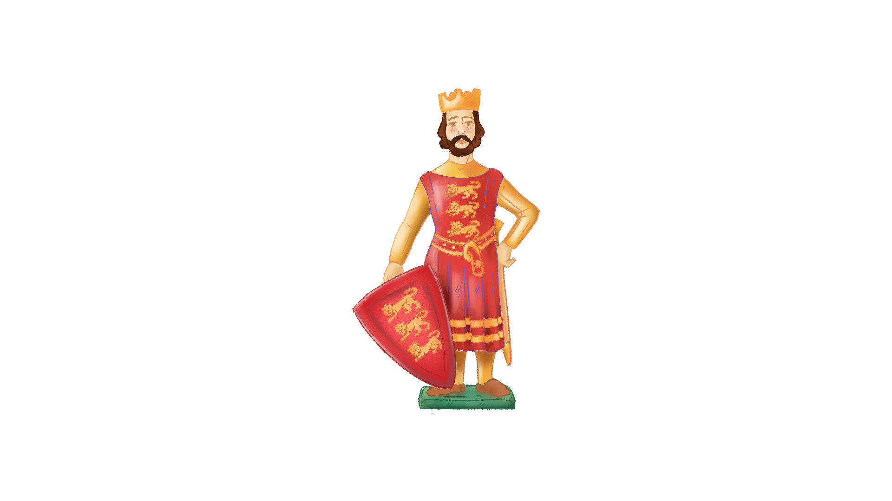

# fig-3.1mm-figuriniste


Cette application a été développée avec le framework **Vue.js** + **Vite**.

# Pré-requis

1. Installer Node.js

2. Installer les dépendances. 
Ouvrir un terminal à la racine du projet :

```
npm install
```

# Lancement de l'application

## Lancement local de l'application


Pour lancer l'application (équivalent à la commande ``vite``)

```
npm run app
```

L'application est alors disponible à l'adresse : http://localhost:5173//figuriniste/

Le chemin ```/figuriniste/``` est renseigné dans le fichier ``vite.config.js`` :

```
  base: '/figuriniste/',
```

Cette commande sera utilisée en prod pour démarrer automatiquement l'application en local et en mode kiosque.

## Lancement automatique

TODO // Démarrage automatique avec ``start-figuriniste.bat`` dans dossier Windows + planificateur de tâches Windows + mode kiosque

# Hébergement en ligne de l'application

## Build

Pour build l'application en statique (équivalent à la commande ``vite build``)

```
npm run build
```

Cette commande sera utilisée en dev/staging pour générer une version web de l'application et l'héberger sur un serveur. 

Le build est alors disponible dans le dossier ``/dist``.


## Hébergement

Téléverser le contenu de ``/dist`` dans un dossier du serveur web correspondant à la base renseignée dans le fichier ``vite.config.js``.

Par exemple,


- La **DEV** est hébergée à http://www.fig.reciproque.com/figuriniste-staging/ ; les fichiers de ``/dist`` ont été placés dans ``/figuriniste-staging/`` et la base renseignée dans le fichier ``vite.config.js`` est :

```
  base: '/figuriniste-staging/',
```

- La **STAGING** est hébergée à : http://www.fig.reciproque.com/figuriniste-staging/ ; les fichiers de ``/dist`` ont été placés dans ``/figuriniste-staging/`` et la base renseignée dans le fichier ``vite.config.js`` est :

```
  base: '/figuriniste-staging/',
```

Ajouter à la racine :

- un fichier ``.htaccess``, afin de masquer les index et protéger le site par mot de passe :
  
```
Options -Indexes

AuthType Basic
AuthName "Espace protégé"
AuthUserFile /xxx/figuriniste-staging/.htpasswd
Require valid-user
```

- un fichier ``.htpasswd``, à générer en utilisant la commande : ``htpasswd -c /path/.htpasswd nom_utilisateur``
  
```
nom_utilisateur:mot_de_passe_encrypté
```

  
- un fichier ``robots.txt``, pour éviter l'indexation du site :

```
User-agent: *
Disallow: /
```

## Données et combinaisons de couleurs

Les dialogues (bulles) et textes d'interface sont respectivement issus des fichiers ``dialogs.json`` et ``interface.json``.
Ceux-si sont fetch depuis le dossier public, il est donc possible de les remplacer à la volée sans relancer l'application locale ou sans re-build les fichiers statiques.

Le dossier ``richards`` contient également les assets et scripts Python permettant la génération des images et QRCodes de l'étape Peinture. 
Les scripts nécessiteront l'installation (dans un environnement virtuel) des librairies ``pillow`` et ``qrcode``.

- ``generate-all-richards.py`` permet de générer toutes les combinaisons de couleur de Richard (243 combinaisons possibles) ;

- ``generate-qrcodes.py`` permet de générer tous les QRCodes correspondant à toutes ces combinaisons, renseignés dans le fichier ``url-qrcodes.csv`` sous la forme d'un nom (colonne ``nom``) et URL associée (colonne ``url``).


## Interfaçage Phidget

TODO // Interfaçage Phidget & doc

